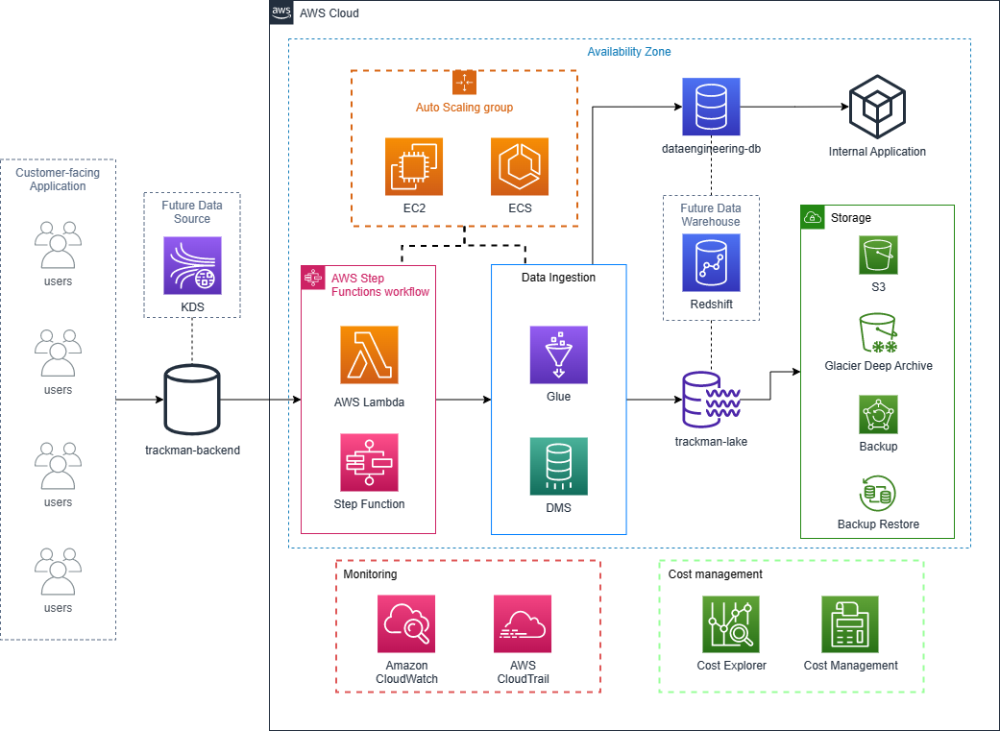

# System Design Challenge

## Data Lake Infrastructure

For this task, I will design a pipeline in AWS for ingesting data into a data lake in S3. Details of the challenge can be found [here](http://designchallenge.trackmandata.com/).

When building a new data lake infrastructure, starting from a green field can be both an opportunity and a challenge. On one hand, there is no existing infrastructure or legacy systems to contend with, providing a blank canvas for designing a scalable, flexible, and efficient data pipeline. On the other hand, starting from scratch requires careful planning, thoughtful design, and a clear understanding of the business requirements and technical constraints that need to be addressed.

Here is the diagram of the system design I recommend for Trackman:

> Diagram for data lake infrastructure **only** contains the logic resources for ETL processes. Other resources, like API gateway, load balancer, network security group, are **not** included in the demonstration.

In this article, I will walk through how this architecture is constructed and how it fits the technical requirements and considerations. I will introduce the selection of AWS services and best practices for cost optimization, data operation, and high availability.

## Start from a Green Field

As a green field project, we have minimal existing infrastructure in place:

* A relation database called trackman-backend.
* An s3 bucket called trackman-lake.

The solution should do the following:

* Read data from multiple different tables in trackman-backend.
* Ingest the data into a different relational database (dataengineering-db) which will be used as the backend for an internal application.
* Load the data into trackman-lake in a suitable format.

## ETL Process

* **AWS Lambda**

    AWS Lambda is a compute service that allows developers to run code without provisioning or managing servers. In the data lake infrastructure, Lambda functions can be used to execute specific ETL tasks, such as processing incoming data, transforming it with custom code, or triggering other AWS services in response to specific events. Lambda will listen to the database for new data using a trigger, and then call the AWS Glue job to extract, transform, and load the data into the dataengineering-db and trackman-lake.

* **Step Function**

    AWS Step Functions is a fully managed service that can be used to coordinate and orchestrate multiple AWS services in a serverless manner. In the context of a data lake infrastructure, Step Functions can be used to create workflows that coordinate the different components of an ETL pipeline, such as triggering data ingestion from multiple tables in a relational database, transforming the data with AWS Glue, and loading it into S3.

* **AWS Glue**

    AWS Glue is a fully managed ETL service that can be used to discover, transform, and move data between various data stores. In the data lake infrastructure, Glue can be used to transform raw data ingested from relational databases, prepare it for analysis, and load it into S3 or another data store. It also has built-in support for parallelism and job scheduling, which will help us to optimize the ETL process.

    It could be useful to implement a monitoring and alerting system to ensure that data is being ingested, transformed, and loaded within the specified timeframes. For example, Glue job Bookmarks can be used to keep track of the progress of a Glue ETL job. Bookmarks can be used to resume a job run from where it left off in case of a failure, and also to track the completion of a job run. Bookmarks can be queried using the AWS Glue API or console to build custom monitoring solutions.

* **AWS Database Migration Service**

    DMS is a fully managed service that can be used to migrate data from one database to another, either within AWS or across different cloud providers. In the context of a data lake infrastructure, DMS can be used to migrate data from a production database, such as trackman-backend, to another database, such as dataengineering-db, which will be used as the backend for an internal application.

## Storage

* **Amazon S3**

    Amazon S3 is an object storage service that provides industry-leading scalability, data availability, security, and performance. We can use AWS S3 as the primary data store for our data lake. The dataengineering-db will also store the ingested data for the internal application. AWS S3 will provide a scalable and cost-effective storage solution that can handle the growing volume of data that will be ingested from various sources in the future.

* **Glacier Deep Archive**

    Glacier Deep Archive is a low-cost, highly durable storage service designed for long-term retention of data that is rarely accessed. In the context of a data lake infrastructure, Glacier Deep Archive can be used to store older or less frequently accessed data, helping to reduce costs by moving infrequently accessed data from S3 to Glacier Deep Archive.

* **AWS Backup**

    AWS Backup is a fully managed backup and recovery service that can be used to centralize and automate the backup of data across AWS services, including S3 and Glacier Deep Archive. In the context of a data lake infrastructure, AWS Backup can be used to ensure that all data stored in S3 and Glacier Deep Archive is regularly backed up to protect against data loss.

* **AWS Backup Restore**

     AWS Backup Restore can be used to quickly and easily restore data from a backup created by AWS Backup. In the context of a data lake infrastructure, this can be useful in the event of accidental data deletion or corruption, allowing administrators to quickly restore data from a backup to minimize downtime.

## Compute Resources

AWS EC2 and ECS can contribute to the solution by providing compute resources for the data lake infrastructure, and their autoscaling capabilities can help to ensure that the infrastructure can handle varying workloads and scale automatically to meet demand.

* **Elastic Compute Cloud**

    EC2 is a service that provides scalable compute capacity in the cloud. It allows us to launch virtual machines (EC2 instances) with a variety of operating systems and configurations to run our applications and workloads.

* **Elastic Container Service**

    ECS is a fully managed container orchestration service that allows us to run Docker containers in the cloud. It simplifies the management of containerized applications by handling tasks such as scaling, load balancing, and container placement.

By using EC2 and ECS with the data lake infrastructure, we can deploy and run ETL jobs and other compute-intensive tasks on scalable, reliable compute resources. This can help to ensure that the infrastructure can handle varying workloads and scale automatically to meet demand.

## Monitoring

AWS CloudWatch and AWS CloudTrail can contribute to the solution by providing monitoring and logging capabilities for the data lake infrastructure.

* **Amazon CloudWatch**

    CloudWatch is an AWS service that provides monitoring and observability for AWS resources and applications. It can be used to monitor metrics, logs, and events from our data lake infrastructure and notify us of any issues or potential problems.

    By using CloudWatch with the data lake infrastructure, we can monitor key metrics such as data ingestion rates, storage usage, and resource utilization to ensure that the infrastructure is performing optimally. We can also set up alarms to notify when certain thresholds are reached or exceeded, so that we can take proactive action to prevent issues.

* **AWS CloudTrail**

    CloudTrail, on the other hand, is an AWS service that provides logging and auditing capabilities for AWS resources and applications. It records API calls and events for our resources, allowing to track changes, troubleshoot issues, and meet compliance requirements.

    By using CloudTrail with the data lake infrastructure, we can log all API calls and events related to the data lake, such as data ingestion, storage, and access requests. This can help us to identify any security or compliance issues, as well as troubleshoot any issues that may arise.

## Cost Optimization

AWS Cost Explorer and Cost Management can contribute to the solution by providing insights into the cost of running the data lake infrastructure and helping to optimize costs.

* **Cost Explorer**

    Cost Explorer is an AWS service that provides visualization tools and reports to help us understand and manage our AWS costs. It allows us to analyze our usage and spending patterns over time, and identify areas where we can optimize our costs.

* **Cost Management**

    Cost Management, on the other hand, is a suite of tools and services that provide additional cost optimization and management capabilities. It includes services such as AWS Budgets, which allows us to set custom cost and usage budgets for our AWS resources, and AWS Cost Anomaly Detection, which uses machine learning to detect anomalies in our usage and spending patterns.

## Availability Zone

* **Availability Zone**

    An AZ is a physically separate location within an AWS region that is designed to be isolated from failures in other availability zones. By deploying resources across multiple AZs, we can improve the availability and durability of our applications and data.

    To include AZs in the solution, the S3 bucket can be replicated across multiple availability zones within the same region. This can be done by enabling cross-AZ replication for the S3 bucket.

    In addition, the ETL process can be designed to distribute the workload across multiple instances in different AZs to improve availability and fault tolerance. This can be achieved by deploying Glue jobs in multiple AZs and using a load balancer to distribute the workload.

    By including availability zones in the solution, the data lake infrastructure can better withstand failures and provide high availability and durability for the ingested data.

## Resources in the future

* **AWS Redshift**

    AWS Redshift can fit into the solution as the data warehouse to store the data for analysts to query in the future. Redshift is a fast and scalable data warehouse solution that can handle large volumes of data and complex queries. It supports availability zone as well.

    The pipeline can be designed to extract data from trackman-backend and transform it into a suitable format for ingestion into Redshift. The data can be loaded into Redshift on a regular schedule, such as every hour, using AWS Glue to perform the ETL process.

    In addition, Redshift can also be used as the backend for the internal application mentioned in the task description, eliminating the need for a separate dataengineering-db. This would simplify the pipeline and reduce the time required for data to be available in the application.

    Overall, using Redshift in conjunction with AWS Glue can provide a scalable and efficient solution for ingesting and storing data from multiple sources in the data lake, while also enabling quick access to the data for analysts and the internal application.

* **Amazon Kinesis Data Streams**

    KDS is a fully managed streaming data service that can be used to collect and process large amounts of data in real-time. In the context of a data lake infrastructure, KDS can be used to capture real-time data from multiple sources, such as IoT devices, clickstream data, or log data, and feed it into an ETL pipeline for further processing and analysis.

    One way to integrate KDS into the solution is to use it as a data source for AWS Glue, which can be configured to read data from KDS and perform transformations on it before loading it into S3 or another data store. This can allow for real-time data ingestion and processing, enabling faster insights and decision-making.

    Another way to use KDS is to trigger Lambda functions in response to incoming data streams. This can be achieved using AWS Lambda and Kinesis Data Streams integration, where the Lambda function can process incoming data and take appropriate actions, such as writing data to S3, sending notifications, or triggering other AWS services.

    Overall, KDS can contribute to the solution by providing real-time data ingestion and processing capabilities, which can enhance the overall data pipeline's speed, flexibility, and responsiveness to changing data needs.

## Aspects of the Solution

* To achieve high scalability 

  * Partitioning the data in S3 based on the data and time of ingestion. This will help optimize queries and reduce the cost of scanning the entire dataset.
  * Using AWS EC2 instances to host the Glue jobs and DMS instances. EC2 instances can be easily scaled up or down based on the workload demands of the jobs.
  * Using AWS ECS to run the Glue jobs in containerized environments. This allows us to easily scale the jobs horizontally to handle larger data sets and processing loads.
  * Using AWS S3's built-in capabilities, such as enabling automatic multi-part uploads, increasing the number of storage buckets, or optimizing the storage configuration to scale the data lake horizontally.

* To achieve high reliability

  * Designing the system with fault tolerance in mind. This means designing the pipeline to handle failure gracefully and automatically retrying failed operations. For example, using `AWS Glue Bookmarks` to keep track of the progress of a Glue ETL job.
  * Considering backup and disaster recovery solutions for the data lake and data warehouse to ensure data availability and continuity in case of any issues.
  * Considering monitoring and alerting using AWS CloudWatch to monitor the health of the Glue jobs and DMS instances, as well as the data lake and dataengineering-db. This allows us to proactively address any issues before they impact the end users.
  * Using AWS Elastic Load Balancers to distribute traffic across multiple instances of our Glue jobs and DMS instances. This ensures that if one instance fails, traffic can be automatically routed to a healthy instance without any service interruption.

* To achieve high maintainability, I recommend

  * Using a serverless architecture that reduces the need for manual intervention and maintenance.
  * Using Infrastructure as Code (IaC) to manage the AWS resources in a repeatable and consistent way. (AWS CloudFormation or Terraform)
  * Considering AWS Code Pipline to automate the building, testing, and deployment of our Glue jobs and DMS instances. This ensures that the deployment process is consistent, repeatable, and reliable.
  * Considering logging and tracing by AWS CloudTrail and AWS X-Ray to track and analyze the execution of our Glue jobs and DMS instances. This allows us to easily debug issues and optimize the performance of our data processing pipelines.

* Cost is a critical factor in any cloud-based solution, and we should properly design the pipeline to optimize cost. To optimize the cost of a pipeline, there are several best practices that can be followed:

  * Use cost-effective services: AWS offers a variety of services that are priced differently based on their features and usage. For example, choosing a more cost-effective data storage service, such as Amazon S3, instead of a more expensive database service can help to reduce costs. AWS Reserved Instances for the EC2 instances and Redshift cluster, S3 Glacier Deep Archive for infrequently accessed data, S3 intelligent-Tiering for data that has changing access patterns.

  * Right-size resources: Use resources that are appropriately sized for the workload. This means selecting resources that are neither too small nor too large for the workload, and that can efficiently handle the expected volume of data. For example, configuring Glue job workers to use minimum required hardware specifications to reduce compute costs, using spot instances for Glue job workers.

  * Leverage serverless architectures: AWS offers serverless architectures, such as AWS Lambda and AWS Step Function, that can help to reduce costs by allowing you to pay only for the compute time used.

  * Use monitoring and analysis tools: Use tools such as AWS Cost Explorer and AWS Trusted Advisor to monitor resource usage and identify cost-saving opportunities.

## Technical Requirements and Considerations

* trackman-backend is a production database, and in order to ensure high availability and prevent service interruptions, I recommend to use AWS Elastic Load Balancers to distribute traffic across multiple instances of Glue jobs and DMS instances. This will allow for automatic failover to healthy instances in the event of a failure, which will help to minimize any potential downtime. By using an Elastic Load Balancer, traffic can be balanced across multiple instances, which can improve the overall performance and reliability of the system. Additionally, Elastic Load Balancers can be configured to automatically scale up or down based on demand, which can help to optimize cost and ensure that the system can handle fluctuating workloads.

* To ensure data arrives in trackman-lake no later than 1 hour after it is first inserted into trackman-backend, we can schedule Glue jobs to run periodically (e.g. every 15 minutes) to check for new data in trackman-backend and load it into trackman-lake. We can also use Lambda functions to trigger Glue jobs in response to events, such as new data being inserted into trackman-backend.

* To ensure data arrives in dataengineering-db no later than 30 minutes after it is first inserted into trackman-backend, we can use DMS to replicate data from trackman-backend to dataengineering-db in near-real-time.

* To accommodate ingesting data from other data sources in the future, we can configure Glue jobs and DMS tasks to read from and write to multiple sources and destinations, respectively.

* To make data available to analysts through a data warehouse, we can use Redshift in conjunction with AWS Glue. It can provide a scalable and efficient solution for ingesting and storing data from multiple sources in the data lake, while also enabling quick access to the data for analysts and the internal application.

* To optimize costs, we can use AWS Cost Explorer to monitor and optimize our AWS costs. We can also leverage cost-saving strategies such as using reserved instances, spot instances, and auto-scaling to optimize our compute resources.

## Summary

After considering the technical requirements and constraints of the project, I have designed a architecture in AWS that can ingest data from multiple tables in the trackman-backend database, transform it into a suitable format, and load it into the data lake and dataengineering-db within the required timeframes.

Future improvements could include expanding the pipeline to ingest data from other data sources in the company (KDS, API gateway), and further optimizing the ETL process for better performance and efficiency.
